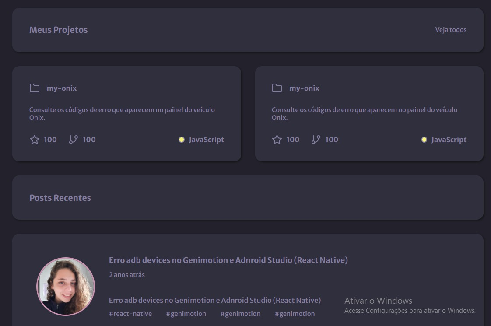

<h1 align="center">
  Portfolio Project
  
</h1>

 

<h4 align="center"> 
	 Status: In progress
</h4>

 <a href="#about">About</a> •
 <a href="#features">Features</a> •
 <a href="#layout">Layout</a> • 
<!--  <a href="#how-it-works">How it works</a> •  -->
<!--  <a href="#tech-stack">Tech Stack</a>  -->
 <a href="#author">Author</a>

<h2>About</h2>

  Portfolio Project is a landing page showing my programming projects and studies, it also shows some informations about me and my work. The project was developed based   on the <a href="https://app.rocketseat.com.br/discover/challenges/portfolio">Rocketseat's challenge</a>.

---

<h2>Features</h2>

➝ You can use this project to base and use it to create your onw Portfolio Project.  
Features already implemented:
 
- Space for the imagem and name of portfolio's owner
- Space to add the link to social medias
- Space to add technologies that the person knows 
- Space to add experiences about projects and others you want
- Space to add your courses and academic studies
- Space to add cards about projects
- Space to add post with coments, information and updates

---

<h2>Layout</h2>
The based layout for the application is avaliable on <a href="https://www.figma.com/file/L6fCiWtOgXCfslQdezqQeF/DD-%2F-Portfolio/duplicate?node-id=3%3A2">Figma</a>, made by Rocketseat.

<h3> Desktop Layout</h3>

 
  
  

  

---

<h2>Author<h2>

 
 
<b>Raquel Ramos Backes</b>
 

  - <a href="https://www.linkedin.com/in/raquel-backes-606482195/">Linkedin</a> 
  - <a href="raquelrbackes@gmail.com">Gmail</a> 
  -

---

